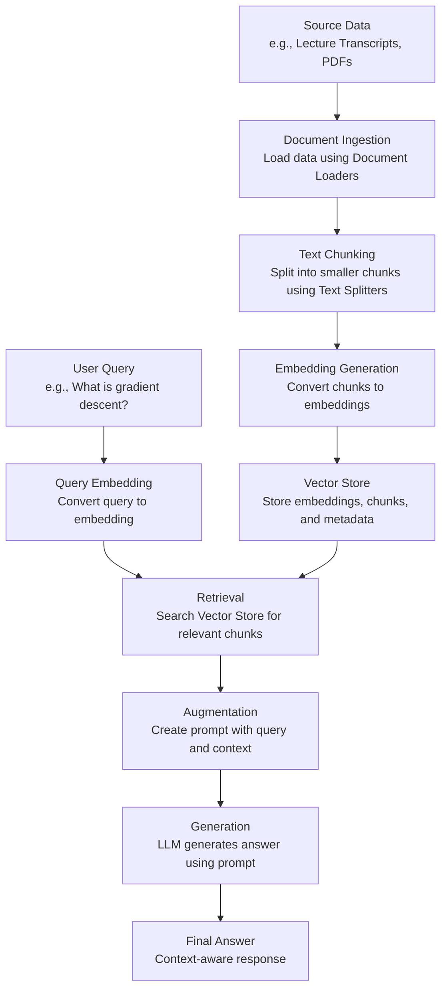

# Retrieval-Augmented Generation (RAG): Comprehensive Notes

These notes provide a clear and beginner-friendly explanation of **Retrieval-Augmented Generation (RAG)**, a key technique in building advanced AI applications using Large Language Models (LLMs). RAG combines information retrieval with text generation to address limitations of LLMs, such as handling private data, recent information, and hallucinations. The notes cover why RAG is needed, what it is, how it works, and its historical context, with a flow diagram for visual clarity.

---

## Introduction to RAG
RAG is a powerful method that enhances LLMs by combining external knowledge retrieval with their text generation capabilities. It’s widely used in applications requiring accurate, context-aware responses, such as chatbots or question-answering systems.

---

## Why RAG? (The Need for RAG)
LLMs, like GPT-3 or LLaMA, are powerful neural networks with billions of parameters trained on vast datasets (e.g., internet-scale data). This training results in **parametric knowledge**, where all learned information is stored in the model’s weights and biases. However, LLMs face limitations when answering queries in certain scenarios:

### Limitations of LLMs
1. **Private Data**:
   - **Problem**: LLMs cannot answer questions about private or proprietary data not included in their training (e.g., a specific lecture video on your website).
   - **Example**: If a student asks, “What was explained about gradient descent in Lecture X?” an LLM like ChatGPT cannot answer because it hasn’t seen the lecture content.
   - **Reason**: Private data wasn’t part of the LLM’s pre-training dataset.

2. **Recent Data**:
   - **Problem**: LLMs have a knowledge cutoff date, so they cannot provide answers about recent events or updates.
   - **Example**: Asking, “What’s the biggest news in India today?” may not yield an answer if the LLM’s training data is outdated (e.g., pre-trained before today).
   - **Reason**: LLMs lack access to real-time data unless connected to external sources (e.g., ChatGPT with internet access).

3. **Hallucinations**:
   - **Problem**: LLMs sometimes generate factually incorrect information with high confidence, a phenomenon called **hallucination**.
   - **Example**: An LLM might claim, “Einstein played football for Germany,” which is entirely made up.
   - **Reason**: LLMs are probabilistic and may invent plausible-sounding but incorrect responses.

### Initial Solution: Fine-Tuning
One approach to address these issues is **fine-tuning**, where a pre-trained LLM is further trained on a smaller, domain-specific dataset. For example:
- **Private Data**: Train the LLM on your private data (e.g., lecture transcripts) to include it in its parametric knowledge.
- **Recent Data**: Fine-tune the LLM with recent data to update its knowledge.
- **Hallucinations**: Train the LLM with examples that teach it to stick to factual responses or say “I don’t know” for uncertain queries.

#### Fine-Tuning Process
1. **Data Collection**: Gather a domain-specific dataset (e.g., labeled question-answer pairs or lecture transcripts).
2. **Method Selection**: Choose a fine-tuning method (e.g., full parameter fine-tuning, LoRA, or QLoRA for efficiency).
3. **Training**: Train the LLM on the dataset for a few epochs, updating its weights.
4. **Evaluation**: Assess the model’s performance using metrics like factual accuracy or hallucination rate.

#### Types of Fine-Tuning
- **Supervised Fine-Tuning**: Train on labeled data (e.g., question-answer pairs).
- **Continued Pre-Training**: Train on unlabeled domain-specific data in an unsupervised manner.
- **RLHF (Reinforcement Learning with Human Feedback)**: Use human feedback to align the model with real-world expectations.

#### Problems with Fine-Tuning
1. **Computationally Expensive**: Training large models requires significant computational resources and costs.
2. **Technical Expertise**: Requires skilled AI engineers or data scientists to execute.
3. **Frequent Updates**: If data changes often (e.g., new course content), repeated fine-tuning is needed, which is costly and time-consuming.
4. **Data Removal**: Removing outdated data (e.g., old courses) from the model’s knowledge requires additional fine-tuning.

Due to these challenges, fine-tuning isn’t always practical for addressing the three limitations.

---

## What is RAG?
**Retrieval-Augmented Generation (RAG)** is a technique that enhances LLMs by providing external context at query time, without modifying the model’s weights. It combines **information retrieval** (fetching relevant data) with **text generation** (using LLMs to produce answers), making it a cheaper and simpler alternative to fine-tuning.

### Key Idea
- Instead of relying solely on the LLM’s parametric knowledge, RAG retrieves relevant information (context) from an external knowledge base and includes it in the prompt.
- The LLM uses this context, along with its parametric knowledge, to generate accurate and context-aware responses.

### Example
Imagine a student watching a 2-hour lecture video on linear regression and having a doubt about gradient descent. Using RAG:
1. The student’s query (“What is gradient descent in Lecture X?”) is sent to a Retriever.
2. The Retriever searches the lecture transcript and fetches the relevant portion (e.g., minutes 5–25 discussing gradient descent).
3. This transcript portion is included in the prompt as context, along with the query.
4. The LLM generates an answer based on the provided context and its parametric knowledge.

### RAG Definition
> **RAG** is a method to make an LLM smarter by providing extra information (context) at the time of answering a question, enabling accurate responses without retraining the model.

---

## Historical Perspective: In-Context Learning
RAG builds on the concept of **in-context learning**, an emergent property of large LLMs.

### What is In-Context Learning?
- **Definition**: In-context learning is the ability of an LLM to learn how to perform a task by seeing examples within the prompt, without updating its weights.
- **Example**: For sentiment analysis, provide examples like:
  - Text: “I love this phone.” → Sentiment: Positive
  - Text: “This app crashes a lot.” → Sentiment: Negative
  - Query: “I hate the battery life.” → LLM predicts: Negative
- The LLM learns the task (sentiment analysis) from the examples in the prompt and applies it to the query.

### Emergent Property
- In-context learning wasn’t explicitly programmed but emerged as LLMs scaled in size and complexity.
- Early models (e.g., GPT-1, GPT-2) lacked strong in-context learning capabilities.
- With **GPT-3** (175 billion parameters), researchers observed that LLMs could learn tasks from prompt examples, as detailed in the landmark paper **“Language Models Are Few-Shot Learners”** (2020).
- The paper showed that GPT-3 could perform tasks like sentiment analysis or named entity recognition by seeing just a few examples, similar to how humans learn from examples.

### From In-Context Learning to RAG
- In-context learning uses **few-shot prompting** (providing examples in the prompt).
- RAG extends this by providing **context** (relevant document chunks) instead of examples, directly addressing the query’s needs.
- Example: Instead of examples, RAG sends the relevant lecture transcript portion to answer a query about gradient descent.

---

## How RAG Works: The RAG Pipeline
RAG combines information retrieval and text generation in a four-step process: **Indexing**, **Retrieval**, **Augmentation**, and **Generation**. Below is a detailed explanation of each step, followed by a flow diagram.

### 1. Indexing
- **Purpose**: Create an external knowledge base that can be efficiently searched during query time.
- **Process**:
  1. **Document Ingestion**: Load source data (e.g., lecture transcripts, PDFs, or company documents) into memory using Document Loaders (e.g., LangChain’s `PyPDFLoader`, `WebBaseLoader`, or `YouTubeLoader`).
  2. **Text Chunking**: Split large documents into smaller, semantically meaningful chunks using Text Splitters (e.g., `RecursiveCharacterTextSplitter`). This ensures chunks are manageable and relevant.
     - **Why?**: LLMs have token limits, and semantic search performs better on smaller chunks.
  3. **Embedding Generation**: Convert each chunk into a dense vector (embedding) using an embedding model (e.g., OpenAI Embeddings, Sentence Transformers).
     - Embeddings capture the semantic meaning of the text in numerical form.
  4. **Vector Store Creation**: Store the embeddings, along with the original text chunks and metadata, in a Vector Store (e.g., FAISS, Chroma, Pinecone).
- **Outcome**: A searchable external knowledge base (Vector Store) containing document chunks and their embeddings.

### 2. Retrieval
- **Purpose**: Fetch the most relevant document chunks from the Vector Store based on the user’s query.
- **Process**:
  1. **Query Embedding**: Convert the user’s query into an embedding using the same embedding model used for the document chunks.
  2. **Semantic Search**: Search the Vector Store to find the embeddings closest to the query embedding (e.g., using cosine similarity).
  3. **Ranking**: Rank the retrieved embeddings to select the top `k` most relevant chunks.
  4. **Fetch Chunks**: Retrieve the original text chunks corresponding to the top-ranked embeddings as the context.
- **Example**: For the query “What is gradient descent?”, the Retriever identifies chunks discussing gradient descent (e.g., minutes 5–25 and 1:43–1:47 of a lecture transcript).
- **Tools**: Use Retrievers like similarity search, MMR, or Contextual Compression Retriever (as discussed in the previous notes).

### 3. Augmentation
- **Purpose**: Create a prompt by combining the user’s query with the retrieved context.
- **Process**:
  - Construct a prompt that includes:
    - Instructions (e.g., “Answer the question using only the provided context. If insufficient, say ‘I don’t know’.”).
    - The retrieved context (e.g., gradient descent transcript).
    - The user’s query (e.g., “What is gradient descent?”).
  - Example Prompt:
    ```
    You are a helpful assistant. Answer the question using only the provided context. If the context is insufficient, say "I don't know."
    Context: [Transcript of gradient descent from minutes 5–25]
    Question: What is gradient descent?
    ```
- **Outcome**: A prompt that enhances the LLM’s knowledge with relevant external context.

### 4. Generation
- **Purpose**: Generate an accurate answer using the augmented prompt.
- **Process**:
  - Send the prompt to the LLM.
  - The LLM uses its parametric knowledge and the provided context to generate a response.
- **Outcome**: A factual, context-aware answer to the user’s query.

---

## RAG Flow Diagram
Below is a simplified flow diagram to illustrate the RAG pipeline:



### Explanation of the Flow Diagram
1. **Indexing**:
   - Source data is loaded, split into chunks, converted to embeddings, and stored in a Vector Store.
2. **Retrieval**:
   - The user’s query is converted to an embedding, and the Vector Store is searched to retrieve relevant chunks (context).
3. **Augmentation**:
   - The query and retrieved context are combined into a prompt.
4. **Generation**:
   - The LLM processes the prompt to generate a response.

---

## How RAG Solves the Three Problems
RAG effectively addresses the three limitations of LLMs:

1. **Private Data**:
   - **Solution**: The external knowledge base is built from your private data (e.g., lecture transcripts). The Retriever fetches relevant chunks, allowing the LLM to answer queries about private data.
   - **Example**: A student’s question about a specific lecture is answered using the lecture’s transcript as context.

2. **Recent Data**:
   - **Solution**: Update the external knowledge base with recent documents (e.g., news articles) without retraining the LLM. The Retriever fetches these updated chunks.
   - **Advantage over Fine-Tuning**: Adding new documents to the Vector Store is cheaper and faster than retraining the model.

3. **Hallucinations**:
   - **Solution**: RAG grounds the LLM’s response in the provided context by explicitly instructing it to use only the context and say “I don’t know” if the context is insufficient.
   - **Result**: Reduces the chance of hallucination by ensuring answers are based on factual, retrieved data.

---

## Advantages of RAG over Fine-Tuning
1. **Cost-Effective**: No need to retrain the LLM, only update the Vector Store with new data.
2. **Simpler**: Requires less technical expertise compared to fine-tuning.
3. **Flexible Updates**: Easily add or remove documents from the knowledge base without modifying the model.
4. **Reduced Hallucinations**: Grounds responses in factual context, improving accuracy.

---

## Key Takeaways
- **RAG Definition**: Combines information retrieval and text generation to enhance LLM performance by providing external context at query time.
- **Why RAG?**:
  - Addresses LLM limitations: private data, recent data, and hallucinations.
  - Cheaper and simpler than fine-tuning.
- **Historical Context**: Builds on in-context learning, an emergent property of large LLMs (e.g., GPT-3), popularized by the paper “Language Models Are Few-Shot Learners.”
- **RAG Pipeline**:
  1. **Indexing**: Create a searchable knowledge base (Document Ingestion → Text Chunking → Embedding Generation → Vector Store).
  2. **Retrieval**: Fetch relevant document chunks using a Retriever.
  3. **Augmentation**: Combine the query and context into a prompt.
  4. **Generation**: Use the LLM to generate a context-aware response.
- **Tools**: Leverages LangChain components (Document Loaders, Text Splitters, Vector Stores, Retrievers).
- **Benefits**: Cost-effective, flexible, and reduces hallucinations compared to fine-tuning.

---

## Homework
- **Task**: Build a simple RAG-based system using LangChain.
- **Steps**:
  1. Load a sample document (e.g., a PDF or YouTube transcript) using a Document Loader.
  2. Split the document into chunks using a Text Splitter (e.g., `RecursiveCharacterTextSplitter`).
  3. Create a Vector Store (e.g., FAISS) with embeddings of the chunks.
  4. Use a Retriever to fetch relevant chunks for a sample query.
  5. Construct a prompt with the query and retrieved context, and generate an answer using an LLM.
- **Example Query**: “What is explained about gradient descent in this document?”
- **Tools**: Use LangChain, FAISS, and an embedding model (e.g., OpenAI Embeddings).

